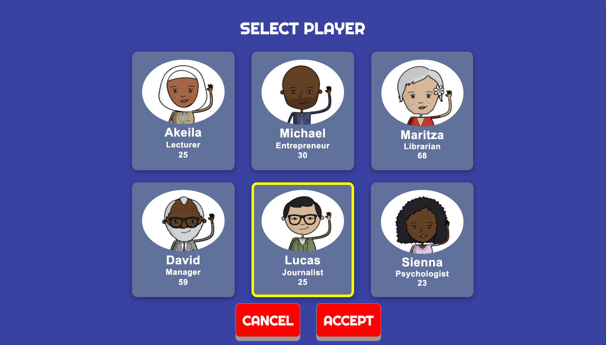
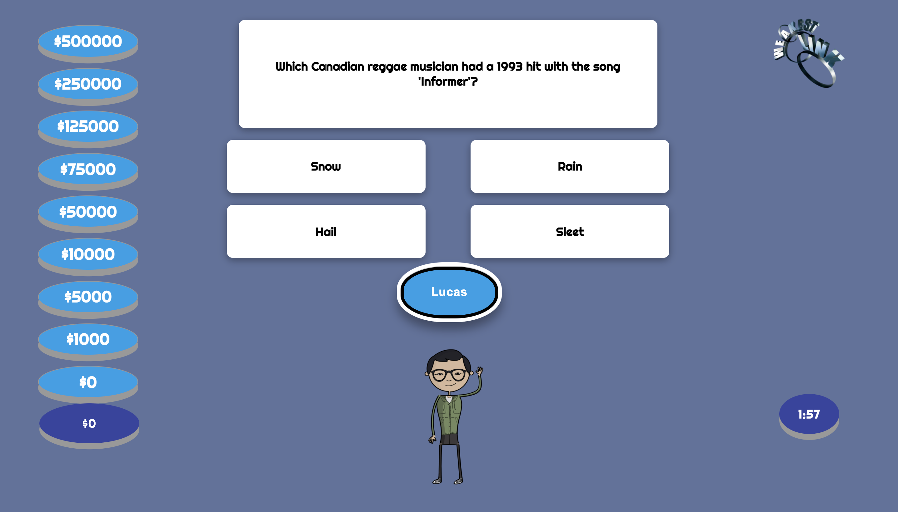

# THE WEAKEST LINK (TWL)
This project illustrates practical experience in building client side web applications using  HTML , CSS, JavaScript and Reactjs.

## TWL GAME DETAILS
<<<<<<< HEAD
The weakest link is a web application based on the famous television game show, of the same name.
=======
The weakest link is a client-side web application based on the famous television game show, of the same name.
>>>>>>> ab688ab8a12b009b77feb001ff03ca78bc1547bf

The game features a single player/avatar who is required to answer general knowledge questions. The game is broken up into three rounds, the first two rounds allow the player to bank and earn money whereas, the last round is a sudden death round that will determine if he or she will walk away with the total money banked in the two previous rounds; or lose the game and be labeled the “WEAKEST LINK.”

Note, the objective of round 1 and 2 is to create a chain of consecutive correct answers to earn an increasing amount of money from a “Money Tree” for a “bank pot” within a specific time limit. An incorrect answer breaks the chain and will cause the player to lose all the money accumulated up to that point; however, the player can say "bank" (press a bank button), prior to their question being asked. This will cause the accumulated money to be stored and will reset the “Money Tree” to zero. 
For every question asked, the game must provide four possible answer choices to allow the player to choose the correct answer.

[The Weakest Link](https://relaxed-goldberg-5662a0.netlify.app/)

## TWL USER INTERFACE

<<<<<<< HEAD

=======

>>>>>>> ab688ab8a12b009b77feb001ff03ca78bc1547bf
